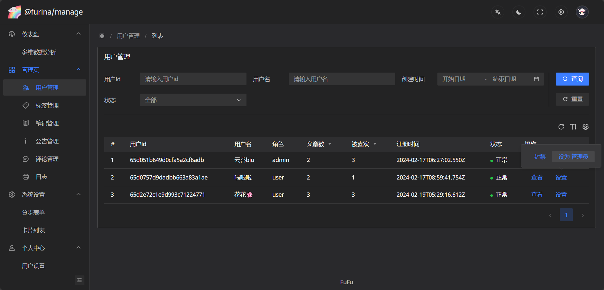
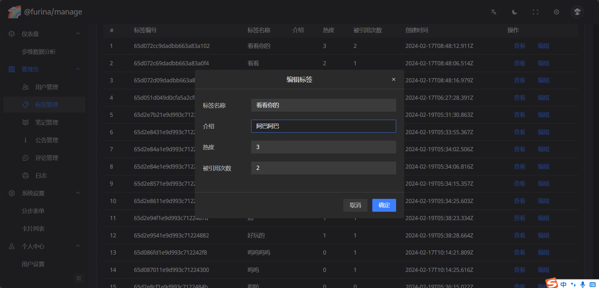
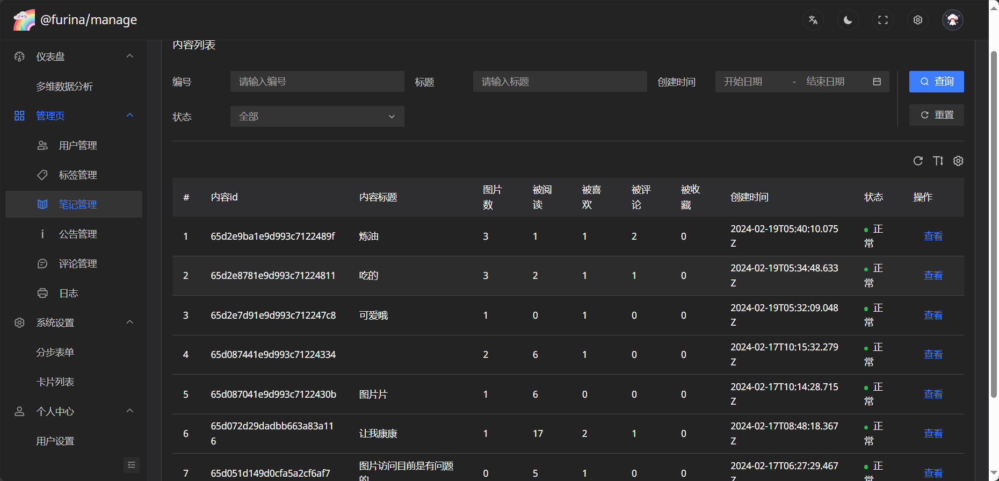
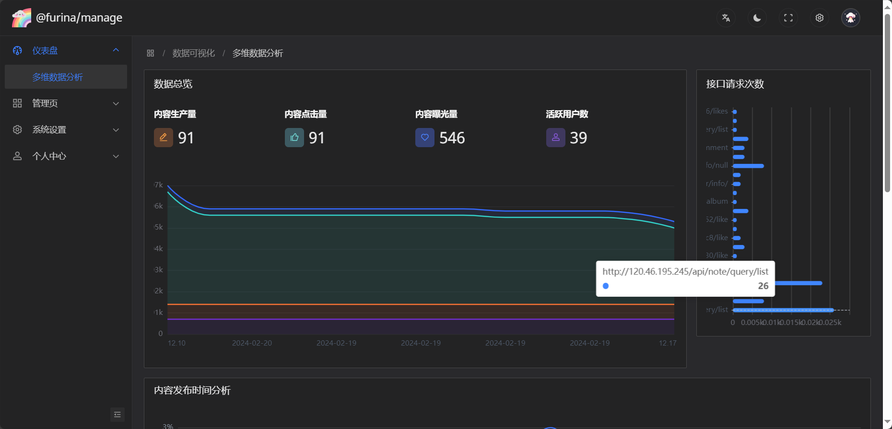
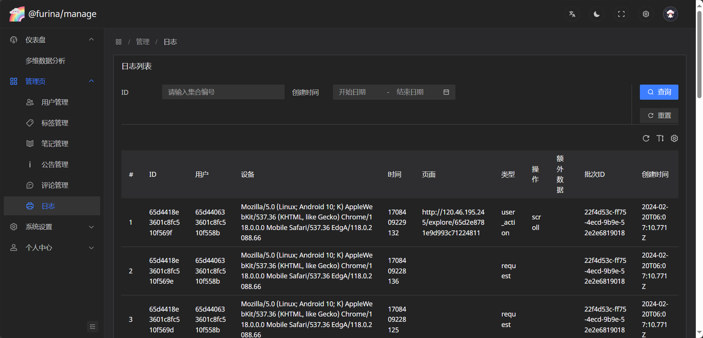

# @furina/manage [](https://github.com/rainbow-dust/manage/blob/main/LICENSE)  [](https://github.com/rainbow-dust/manage/actions/workflows/build.yml)

## description

this repo is the front-end part of the furina, base on vue, arco-design-pro... building for user interface and management.
related projects:

- [app](https://github.com/rainbow-dust/app)
- [server](https://github.com/rainbow-dust/server)
- [manage](https://github.com/rainbow-dust/manage)

## features

- dashboard
  - data statistics and charts overview
- manage (query/modify/block data)
  - user
  - note
  - comment
  - tag
  - notice
  - log

screenshots:






## development

### start the project

```bash
pnpm install
pnpm dev
```

### project structure

```yaml
.
├── src
│   ├── views             # views, main part of the app
│   ├── router            # router 
│   ├── locale            # i18n, ...need to learn
│   └── mock              # system mock data,... also need to learn
├── ├──......             # many other features, naming and folder structures... need to learn
└── README.md
```
